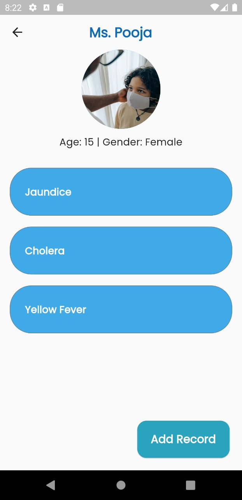
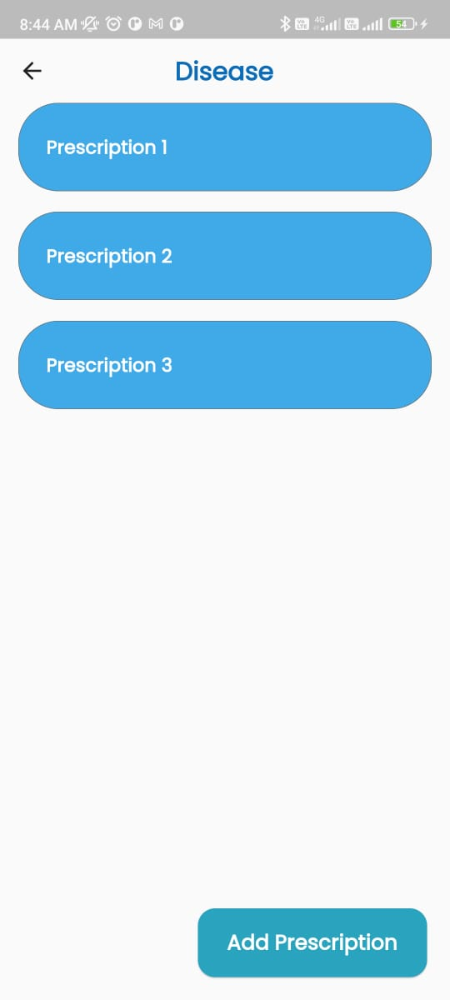

<!--  -->
# Med-Rec

##### A Patient's medical history.
Med-Rec is a user-friendly platform for doctors to update and access a patient's medical history.

#### Why do we need medical history?
A number of diseases can be identified by observing **patterns of previous diseases and medications**. 

### The Problem
* Doctors do not have access to medical history.
* In developed countries, doctors keep digital records but these records aren't inter-connected.
* There's no standard format for keeping these records.

### Why Med-Rec?
* **User-friendly** platform to track patient's medical history
* **Standard format** for all users ( doctors ).
* **Data privacy** of users. Only authorized doctors can access medical records.
* **Authenticate Doctors** using their license number.
> future scope: Patient will receive an **OTP** when a doctor wants to access the medical record.

## Application Walkthrough

#### Login page
Doctor will provide their credentials and redirected to dashboard.

#### Dashboard
Here we get options for **searching a patient via Aadhar card** or **Add new patient in database**

#### Add new user

#### Seach Result
Tap on found patient, it'll redirect to the patient-info page

#### Patient Info
This page includes basic patient info and **list of diseases**.
**Most recent diseases stay on top**

#### Disease page
This page include **list of prescriptions** related to that disease. **Most recent prescription stay on top**.

#### Prescription page

## The Powerpuff Boys team

1. [Naman vyas]("www.github.com/coder-rancho"): Product Manager
2. [Bishwajeet Parhi]("https://github.com/2002Bishwajeet"): App developer
3. [Harsh Sharma]("https://github.com/harshsH-28"): Backend developer
4. [Vidhu Mathur]("https://github.com/Kranium2002"): Frontend developer
5. Swapnil Jha: PPT and stuff.